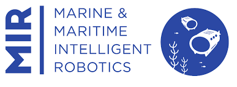
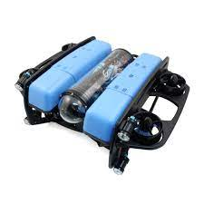

[![Contributors][contributors-shield]][contributors-url]
[![Forks][forks-shield]][forks-url]
[![Stargazers][stars-shield]][stars-url]
[![Issues][issues-shield]][issues-url]
[![MIT License][license-shield]][license-url]
[![LinkedIn][linkedin-shield]][linkedin-url]

 

  <h1 align="center">Project Title</h1>

  

    Brief Summary of the Project.
     
    
    .
    
     
    <a href="https://github.com/olanrewajufarooq/AssignmentTemplate">View Project Files »</a>
     
  

## Description

Description of the project goes here.

  
   Image of the description

## Tasks Completed in the project include:

List of tasks fulfilled in the project are highlighted here.

1. Task 1. 
2. Task 2.

## Tools Used

List of the packages used or dependencies are mentioned here.

- Python Programming
- OpenCV

## Usage

The details of the execution manner or usage of the project goes here.

1. Step 1.
2. Step 2.
3. Et cetera

## Results

Provide details of results here (if available).

<!-- CONTACT -->
## Contributors and Contacts

* Farooq Olanrewaju - olanrewajufarooq@yahoo.com

<!-- MARKDOWN LINKS & IMAGES -->
<!-- https://www.markdownguide.org/basic-syntax/#reference-style-links -->
[contributors-shield]: https://img.shields.io/github/contributors/olanrewajufarooq/AssignmentTemplate.svg?style=for-the-badge
[contributors-url]: https://github.com/olanrewajufarooq/AssignmentTemplate/graphs/contributors
[forks-shield]: https://img.shields.io/github/forks/olanrewajufarooq/AssignmentTemplate.svg?style=for-the-badge
[forks-url]: https://github.com/olanrewajufarooq/AssignmentTemplate/network/members
[stars-shield]: https://img.shields.io/github/stars/olanrewajufarooq/AssignmentTemplate.svg?style=for-the-badge
[stars-url]: https://github.com/olanrewajufarooq/AssignmentTemplate/stargazers
[issues-shield]: https://img.shields.io/github/issues/olanrewajufarooq/AssignmentTemplate.svg?style=for-the-badge
[issues-url]: https://github.com/olanrewajufarooq/AssignmentTemplate/issues
[license-shield]: https://img.shields.io/github/license/olanrewajufarooq/AssignmentTemplate.svg?style=for-the-badge
[license-url]: https://github.com/olanrewajufarooq/AssignmentTemplate/blob/main/LICENSE
[linkedin-shield]: https://img.shields.io/badge/-LinkedIn-black.svg?style=for-the-badge&logo=linkedin&colorB=555
[linkedin-url]: https://linkedin.com/in/olanrewajufarooq